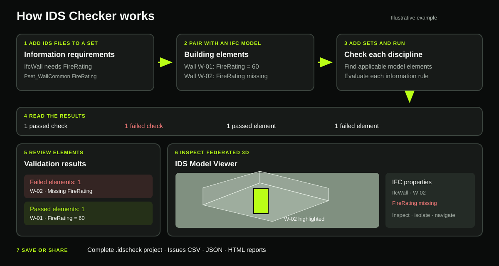

# IDS Checker: model validation in your browser

IDS Checker compares an IFC building model with one or more Information Delivery Specification (`.ids`) files. It shows which information each IDS file requires, runs the checks, explains failures, and lets you inspect the affected elements in a whole-building 3D viewer. It runs locally on your computer; the browser is the interface.



The illustration uses two fictional walls. It demonstrates the difference between a **check** (one requirement evaluated for an element) and an **element** (one IFC object, which can have several checks).

## Start using IDS Checker

### Windows: one-click installer

1. Download the latest `IDS-Checker-Setup.exe` from [Releases](https://github.com/champeon492-afk/ids-checker/releases).
2. Run the installer. It includes Python and the application; no separate Python or Node.js installation is needed. It creates **IDS Checker** desktop and Start menu shortcuts. Windows may display a warning because the installer is unsigned.
3. Open the **IDS Checker** shortcut. It starts the local server and opens the app in your default browser. Keep the local server running while you work.

The installer is per user and does not require administrator rights. It also provides an uninstaller. Updating to a newer installer keeps saved projects in `%LOCALAPPDATA%\IDS Checker\projects`.

### From source

Use Python 3.12. On Windows, double-click `start-validator.cmd` and keep its command window open while using the browser. Or run:

```powershell
py -3.12 -m venv .venv
.venv\Scripts\python -m pip install -r requirements.txt
.venv\Scripts\python -m streamlit run app.py
```

The source version stores automatic project copies in `local_workspaces/` beside the app. This folder is excluded from Git.

## Validate a model: step by step

1. **Upload IDS requirements.** In **1. Upload IDS requirements**, choose one or more `.ids` files. Every uploaded IDS file will be checked against the same IFC model. The **Checks defined by the IDS files** table shows the source file, specification, IFC version, target elements, selection rule, requirement, and rule type. Review it to confirm the intended classes and information requirements.
2. **Upload one IFC model.** In **2. Upload IFC model**, choose a `.ifc` file. The app accepts one model per validation. To test a different model, start a new validation.
3. **Run validation.** Select **Run validation**. IfcTester finds model elements matching each specification's applicability rules, then evaluates the IDS requirements for those elements. A required specification with no matching elements can itself fail. The app creates a local saved project after the run.
4. **Read the summary.** The top metrics count IDS files, specifications, passed checks, failed checks, and listed issues. The 3D workspace separately counts distinct failed and passed IFC elements; see [Understanding the counts](#understanding-the-counts).
5. **Investigate failures.** Open **Building viewer**. Choose an IFC class in **Errors by IFC class** to filter its failures and highlight its affected elements. Choose a failed element card to frame it in 3D. The selected element's issue panel gives the IDS rule and a more specific explanation, such as a missing property set, missing property, empty value, incorrect value, or wrong data type when the rule provides that information.
6. **Inspect the IFC data.** Turn on **Properties** to see IFC attributes, type, property sets, and quantities for the selected element. Turn on **Model browser** to navigate the IFC relationship from project through site, building, storey, class, and element. Select a relationship tile to highlight the elements it contains, or choose a single element. The validation list follows a selected element when it has recorded checks.
7. **Review passes and export.** Switch the viewer's **Passed elements** tab to see elements with at least one successful check and why they passed. Use the top **Issues**, **Passed elements**, and **By IDS file** tabs for tables and specification details. Use **Downloads** to save results or the complete project.

### Worked example

Suppose an IDS file requires `Pset_WallCommon.FireRating` on `IfcWall` elements. The IFC model contains two walls:

| IFC element | IFC value | Result |
| --- | --- | --- |
| `W-01` | `FireRating = 60` | One passed check; shown in **Passed elements**. |
| `W-02` | `FireRating` is absent | One failed check and one issue; shown in **Failed elements**. |

Select `W-02` in the failed list. IDS Checker frames that wall in 3D and explains which property must be added. **Isolate selected** makes the other building elements transparent. The **Properties** panel lets you verify the wall's current IFC data. After correcting and exporting the IFC in your authoring tool, upload the revised IFC and run validation again.

## Understanding the counts

| Display | What it counts |
| --- | --- |
| **IDS files** | Number of `.ids` files checked. |
| **Specifications** | Total specifications across those files. |
| **Checks passed** | Successful requirement evaluations reported by IfcTester. One element can pass several checks. |
| **Checks failed** | Failed requirement evaluations reported by IfcTester. One element can fail several checks. |
| **Issues listed** | Rows in the issue table. They include element-level failures and any specification-level issue without an individual model element. This can differ from **Checks failed** in some reports. |
| **Failed elements** | Distinct IFC elements with at least one recorded failure. Specification-level issues without an IFC `GlobalId` remain in the failure list but are not counted as elements. |
| **Passed elements** | Distinct IFC elements with at least one recorded successful check. |

An element can appear in **both** element lists when it passes one IDS requirement and fails another. The counts are not intended to add up to a total model element count. The **Errors by IFC class** chart counts *issues*, not distinct elements.

## Feature guide

### IDS requirement preview and results

- Preview each uploaded specification's target IFC entities and requirements before starting validation.
- Validate one IFC model against multiple IDS files in the same run.
- View an overall status and five summary metrics.
- Open **Issues** for one row per listed failure, including IDS file, specification, requirement, IFC class, `GlobalId`, element name, and reason.
- Open **Passed elements** for successful element checks. An **Also has failures** marker identifies elements that passed some rules but failed others.
- Open **By IDS file** for specification status, applicability, matched element count, and per-requirement pass and fail totals.
- Select **Re-run validation** for the currently loaded model and IDS files.

### IDS Model Viewer

- Load and orbit the whole IFC building with the That Open viewer; drag to orbit and scroll to zoom.
- Search the failed and passed element lists. The lists initially show a limited number of cards; **Show more** reveals additional results.
- Click a class bar to filter failures by IFC class and highlight the corresponding model elements. Class bar values count validation issues.
- Select an element card, click a model element with **Select in 3D** enabled, or choose it in **Model browser**. The selection is highlighted in lime and its recorded results appear in the viewer.
- Turn on **Isolate selected** to make other elements transparent. The setting remains active while navigating between elements and relationship tiles; turn it off to restore normal visibility.
- Use **Clear selection** to remove the active element or group selection, and **Fit building** to frame the entire model.
- Open **Properties** for the selected object's IFC attributes, type, property sets, and quantities. Elements without viewable geometry can still have readable properties and validation results.
- Open **Model browser** below the workspace. Connected columns show project → site → building → storey → IFC class → element. A tile can highlight its entire contained group; an element tile selects that individual object. Use the browser's search field to find an element by name, IFC class, or `GlobalId`.

### Save, resume, and share

- After a run, the app keeps a local copy of the IFC model, all IDS files, validation results, and reports. The `workspace` value in the browser URL points to that local copy. Refreshing the page or reopening the URL on the **same computer** restores it while the app server is available.
- In **Downloads**, select **Save complete project (.idscheck)** to keep a portable project file wherever you choose. This contains the IFC, IDS files, reports, issues, and successful checks. To continue later or share with a teammate, use **Open a saved validation project** and choose that file. Sharing only the browser URL will not transfer the project to another computer.
- Also available in **Downloads**: issues CSV, full JSON report, one HTML report for a single IDS file, or a ZIP of HTML reports when several IDS files were checked.
- Use **Start a new validation** to leave a restored project and upload a new set of files.

## Troubleshooting

| Symptom | What to do |
| --- | --- |
| Browser says **Connection lost** | Start IDS Checker again with its shortcut, or restart `start-validator.cmd` when using source, then refresh the browser tab. The local server must be running. |
| Viewer stays on **Converting IFC geometry** | Large IFC models can take time to convert. Keep the tab open. The 3D viewer needs access to its That Open worker and Web IFC files on `unpkg.com`. |
| An element has results but is not visible in 3D | It may not have viewable geometry. Use its result card and **Properties** to inspect the IFC data. |
| A required specification has no matching IFC elements | Check the IDS applicability, target IFC class, and model contents. A required specification can fail when no model element matches. |
| A teammate cannot open your saved browser URL | Send the `.idscheck` file instead, then have them open it in their own installed IDS Checker. |

## Data and implementation notes

The app runs on localhost and does not require accounts or a database. Streamlit handles uploads in the running local server. The temporary viewer endpoint is token protected. The local project copy is excluded from GitHub. For shared or public hosting, deploy only where your model data is allowed to be processed.

- [IfcTester](https://docs.ifcopenshell.org/ifctester.html) performs IDS/IFC validation. The preview table is a readable summary of the IDS rules; the full IDS rules are applied by IfcTester.
- [Streamlit](https://docs.streamlit.io/) provides the browser interface.
- [That Open](https://docs.thatopen.com/) provides the 3D IFC viewer. The bundled viewer is included in this repository; Node.js is needed only to rebuild its JavaScript after changing `frontend/viewer.js`.
- The viewer styling uses the supplied Orion Twin design system's colors and components. Its visible header is **IDS Model Viewer**.

To rebuild the viewer after a code change, run `npm install` and `npm run build` in `frontend/`, then commit `frontend/viewer.bundle.js`. The Windows installer is built by `.github/workflows/windows-installer.yml` with scripts in `packaging/`.
